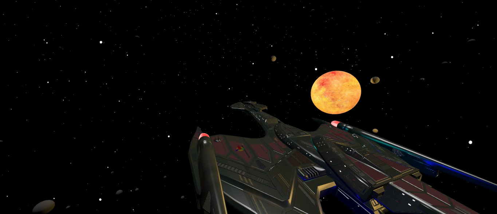
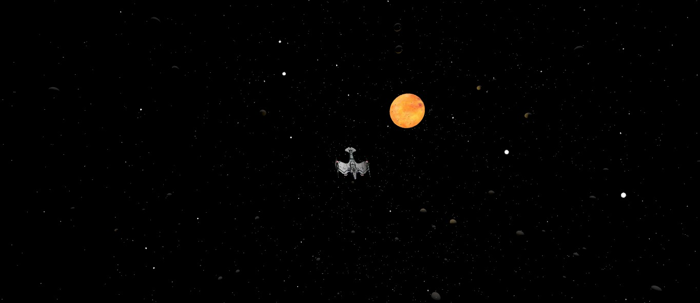
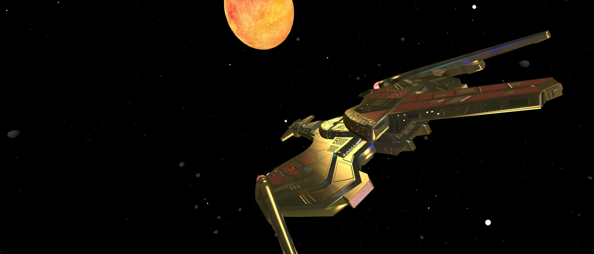

# 🌌 Galactic Havoc 🚀

**Galactic Havoc** é a evolução do antigo **CAOS Cósmico – Missão Estelar**, agora reescrito em **React Native + Expo** para proporcionar uma experiência nativa e imersiva em dispositivos móveis.  
O jogo combina aventura espacial, controle via joystick virtual e ranking online de jogadores, mantendo a essência caótica e cósmica do jogo original.

## 🎮 Funcionalidades Principais

- **Joystick virtual** para controle do player em tempo real  
- **Arena responsiva** adaptável para qualquer tela  
- **Cutscenes e narrativa interativa**  
- **Ranking online** integrado via API  
- **Interface intuitiva** e menus otimizados para mobile

## 🛠️ Tecnologias

- React Native + Expo  
- JavaScript moderno (ES6+)
- Git para versionamento

## 📱 Disponibilidade

Em breve disponível na **Google Play Store** e **Apple App Store**!  
[🛒 Acompanhe o lançamento](#) – Em breve o link será colocado!

## 🚀 Status do Projeto

Em desenvolvimento – lógica do jogo e componentes base estão sendo construídos, marcando o início da era **Galactic Havoc**.

## 📷 Screenshots

  

## 📜 Licença

Este projeto está licenciado sob a **MIT License**. Veja o arquivo [LICENSE](LICENSE) para mais detalhes.

## 🌟 Contribuição

Contribuições são sempre bem-vindas!  
Sinta-se à vontade para abrir **issues**, sugerir melhorias ou enviar **pull requests**.  
Vamos juntos expandir o universo de **Galactic Havoc**! 🌠  

### 👨‍🎨 Contribuidores
- **[@GustavoWarmeling05](https://github.com/GustavoWarmeling05)** — responsável pela modelagem dos asteroides que hoje cruzam o nosso cosmos 🪨✨
