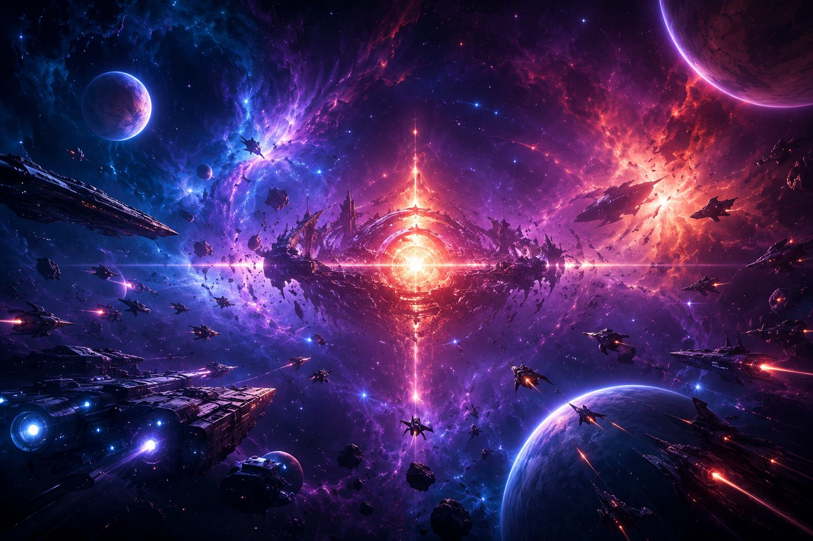
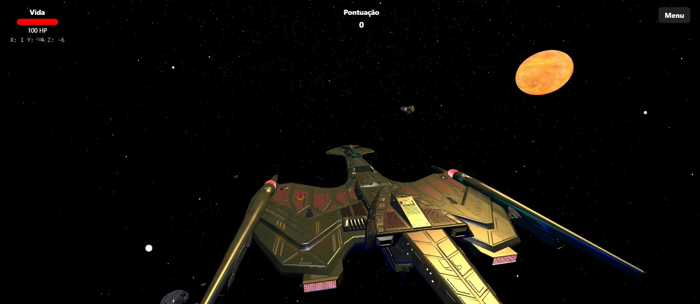
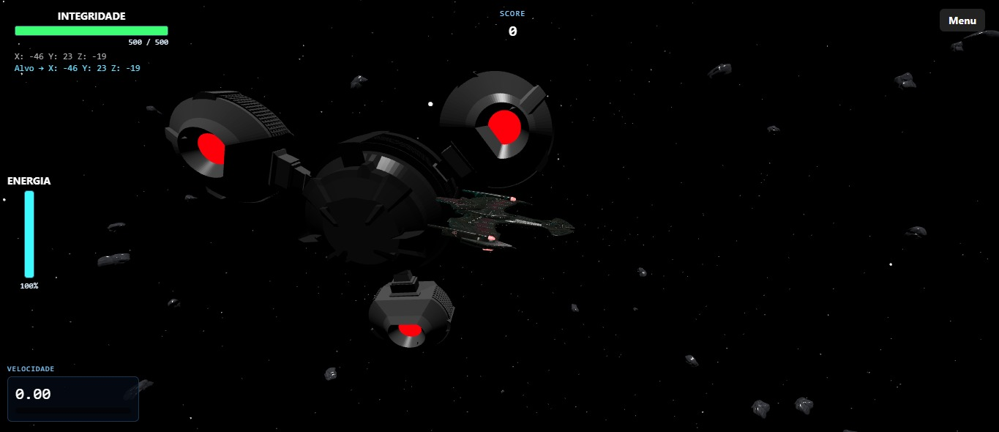
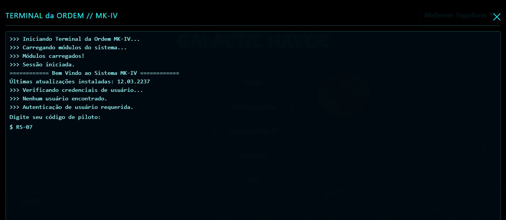
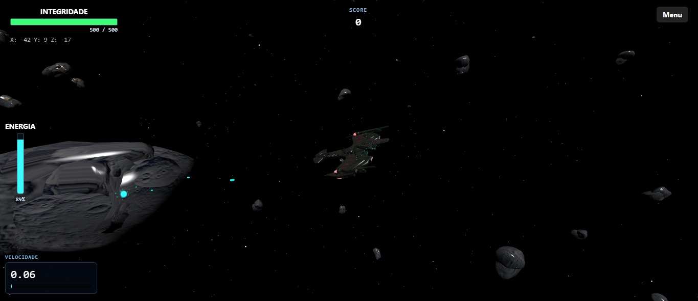

# Galactic Havoc



**Galactic Havoc** é um jogo espacial 3D interativo desenvolvido com **React Native + Expo**, focado em combate, exploração e uma experiência imersiva diretamente no navegador.

> Evolução do projeto **CAOS Cósmico – Missão Estelar**

## Jogue Agora

👉 https://galactic-havoc-lyart.vercel.app/

## Funcionalidades

- **Cutscenes e narrativa interativa**
- **Controle de nave em ambiente 3D**
- **Interface imersiva**
- **Sistema de áudio dinâmico**
- **Acesso direto pelo navegador (sem instalação)**
- **Ranking online integrado (em evolução)**

## Tecnologias

- React Native + Expo  
- Three.js  
- JavaScript (ES6+)
- Git + Vercel (deploy contínuo)

## Como rodar localmente

```bash
npm install
npx expo start
```

## Sobre o projeto

**Galactic Havoc** representa a transição de um projeto experimental para uma experiência jogável e acessível globalmente.

A nova arquitetura com **Expo + Web** permite que qualquer jogador acesse o jogo diretamente pelo navegador, sem necessidade de instalação, abrindo caminho para futuras expansões como:

- 📱 Publicação mobile (Android / iOS)
- 🌍 Multiplayer online
- 🧠 IA avançada (em desenvolvimento)
- 👻 Eventos e elementos dinâmicos no universo do jogo

## Screenshots

  
  



## Status do Projeto

Em desenvolvimento ativo  

✔ Versão web funcional publicada  
✔ Sistema base de gameplay implementado  
🔄 Melhorias visuais e estabilidade em progresso  

## Licença

Este projeto está licenciado sob a **MIT License**.  
Veja o arquivo [LICENSE](LICENSE) para mais detalhes.

## Contribuição

Contribuições são bem-vindas!

Sinta-se à vontade para:
- abrir **issues**
- sugerir melhorias
- enviar **pull requests**

## Contribuidores

<table>
  <tr>
    <td align="center">
      <a href="https://github.com/Gabriel0Ramos0">
        <br/>
        <strong>@Gabriel0Ramos0</strong><br/>
        Desenvolvimento principal
      </a>
    </td>
    <td align="center">
      <a href="https://github.com/GustavoWarmeling05">
        <br/>
        <strong>@GustavoWarmeling05</strong><br/>
        Modelagem 3D Asteróides
      </a>
    </td>
  </tr>
</table>
