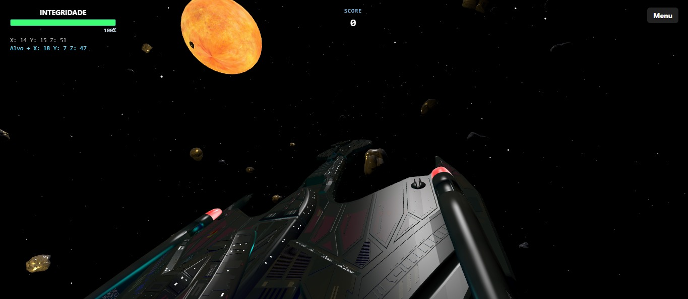

# Galactic Havoc

**Galactic Havoc** é a evolução do antigo **CAOS Cósmico – Missão Estelar**, agora reescrito em **React Native + Expo** para proporcionar uma experiência nativa e imersiva em dispositivos móveis.  
O jogo combina aventura espacial, controle via joystick virtual e ranking online de jogadores, mantendo a essência caótica e cósmica do jogo original.

## 🎮 Funcionalidades Principais

- **Cutscenes e narrativa interativa**  
- **Ranking online** integrado via API  
- **Interface intuitiva** e menus otimizados

## 🛠️ Tecnologias

- React Native + Expo  
- JavaScript moderno (ES6+)
- Git para versionamento

## 📱 Disponibilidade

Em breve disponível na **Google Play Store** e **Apple App Store**!  
[Acompanhe o lançamento](#) – Em breve o link será colocado!

## Status do Projeto

Em desenvolvimento – lógica do jogo e componentes base estão sendo construídos, marcando o início da era **Galactic Havoc**.

## Screenshots

 
   

## 📜 Licença

Este projeto está licenciado sob a **MIT License**. Veja o arquivo [LICENSE](LICENSE) para mais detalhes.

## 🌟 Contribuição

Contribuições são sempre bem-vindas!  
Sinta-se à vontade para abrir **issues**, sugerir melhorias ou enviar **pull requests**.  
Vamos juntos expandir o universo de **Galactic Havoc**! 🌠  

### 👨‍🎨 Contribuidores

<table>
  <tr>
    <td align="center">
      <a href="https://github.com/Gabriel0Ramos0">
         
        <strong>@Gabriel0Ramos0</strong> 
        Desenvolvimento principal
      </a>
    </td>
    <td align="center">
      <a href="https://github.com/GustavoWarmeling05">
         
        <strong>@GustavoWarmeling05</strong> 
        Modelagem dos asteroides
      </a>
    </td>
  </tr>
</table>
